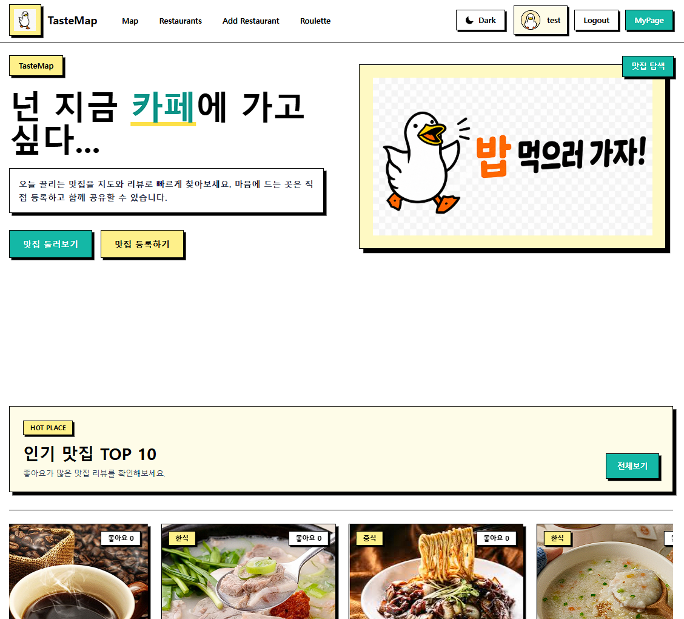
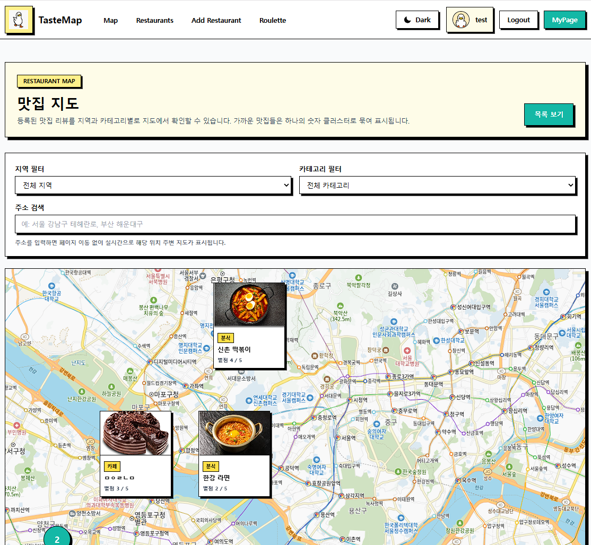
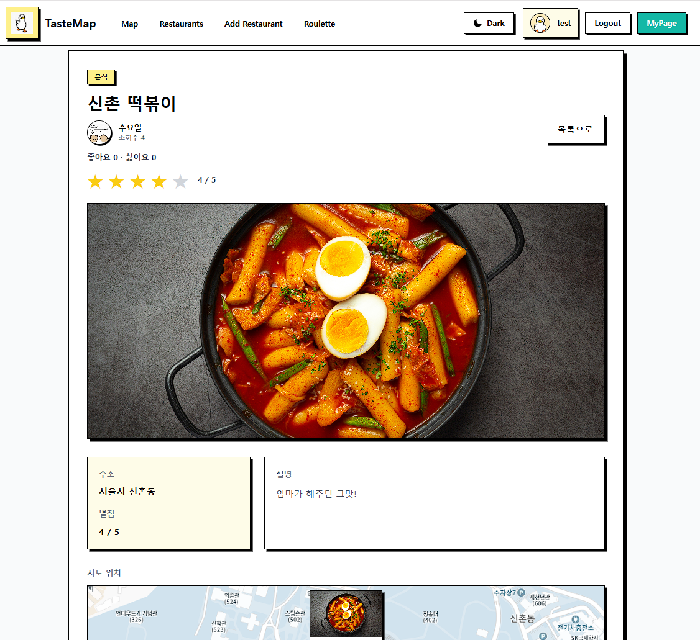
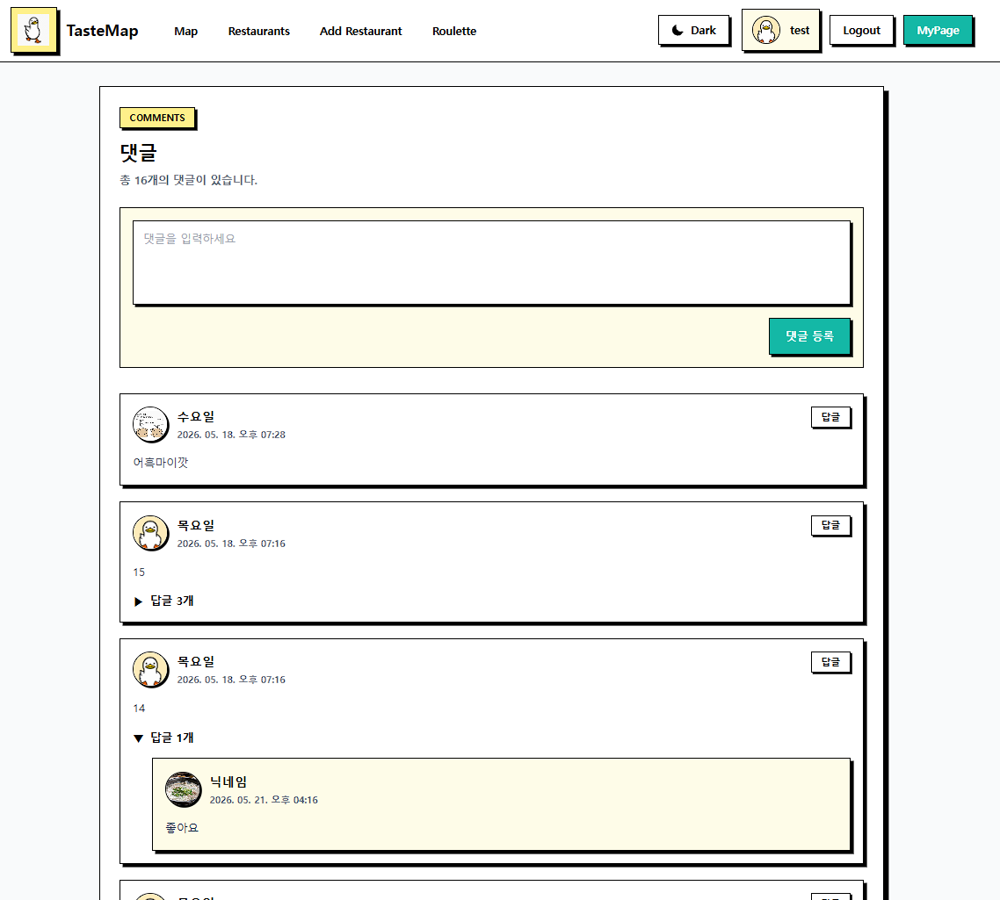
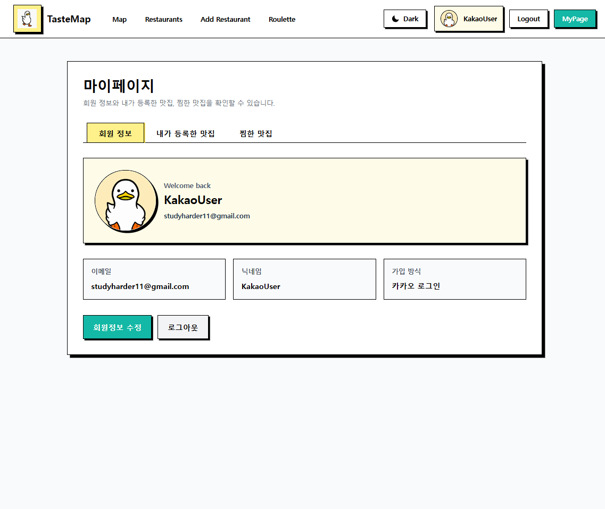

# 🍽 Restaurant Review Service

> 지도 기반 맛집 리뷰 및 추천 웹 서비스
> 地図を活用した飲食店レビュー・おすすめWebサービス

**개인 프로젝트 / 個人開発**

React와 Spring Boot를 활용하여 사용자가 맛집을 탐색하고, 상세 정보를 확인하며, 리뷰를 작성하고 관리할 수 있도록 개발한 Full-Stack 웹 애플리케이션입니다.

프론트엔드부터 백엔드, 데이터베이스, 인증까지 직접 구성하여 웹 서비스 전체 개발 과정을 경험하는 것을 목표로 개발했습니다.

---

# 🇰🇷 한국어

## 📌 프로젝트 소개

맛집을 찾을 때 검색, 위치 확인, 리뷰 확인 등의 과정이 서로 다른 서비스에서 이루어지는 불편함을 줄이기 위해 개발한 지도 기반 맛집 리뷰 서비스입니다.

사용자는 맛집 정보를 확인하고 다른 사용자의 리뷰를 참고할 수 있으며, 로그인 후 자신의 리뷰 및 사용자 정보를 관리할 수 있습니다.

단순 화면 구현이 아니라 React Frontend와 Spring Boot Backend를 REST API로 연결하고, JWT 인증과 MySQL 데이터베이스를 적용하여 하나의 Full-Stack 웹 서비스로 구현했습니다.

---

## 👨‍💻 개발 형태

**개인 프로젝트**

기획, Frontend, Backend, Database 및 API 연동을 직접 구현했습니다.

---

# 🛠 Tech Stack

## Frontend

* React
* JavaScript
* Vite
* React Router
* Tailwind CSS
* Zustand
* Axios

## Backend

* Java
* Spring Boot
* Spring Data JPA
* Spring Security
* JWT

## Database

* MySQL

## Authentication

* JWT Authentication
* Kakao Login

## Development Tools

* Git
* GitHub
* IntelliJ IDEA
* Visual Studio Code
* Postman

---

# 🏗 System Architecture

```text
               ┌──────────────────┐
               │       User       │
               └────────┬─────────┘
                        │
                        ▼
               ┌──────────────────┐
               │   React + Vite   │
               │     Frontend     │
               └────────┬─────────┘
                        │
                   Axios / REST API
                        │
                        ▼
               ┌──────────────────┐
               │   Spring Boot    │
               │     Backend      │
               └───────┬──────────┘
                       │
              ┌────────┴────────┐
              ▼                 ▼
       ┌─────────────┐    ┌─────────────┐
       │    MySQL    │    │ External API│
       │  Database   │    │ Map / Login │
       └─────────────┘    └─────────────┘
```

---

# 🖥 Service Preview

## 🏠 Main Page



서비스의 메인 화면입니다.

사용자가 맛집 관련 정보를 쉽게 탐색하고 주요 기능으로 이동할 수 있도록 구성했습니다.

---

## 🗺 Restaurant Search / Map



지도와 맛집 정보를 연결하여 사용자가 위치를 기반으로 음식점을 탐색할 수 있도록 구성했습니다.

Frontend에서 사용자 입력 및 지도 관련 상태를 관리하고 필요한 데이터를 API를 통해 Backend와 주고받도록 구현했습니다.

---

## 🍽 Restaurant Detail



선택한 맛집의 상세 정보를 확인하는 화면입니다.

맛집의 기본 정보뿐만 아니라 사용자 리뷰 등 서비스 이용에 필요한 데이터를 하나의 상세 화면에서 확인할 수 있도록 구성했습니다.

---

## ✍️ Review



로그인한 사용자가 방문한 맛집에 대해 리뷰를 작성하고 관리할 수 있습니다.

리뷰 데이터는 Spring Boot REST API를 통해 MySQL에 저장됩니다.

```text
React Review Form
        ↓
       Axios
        ↓
Spring Boot Controller
        ↓
     Service
        ↓
      JPA
        ↓
      MySQL
```

---

## 👤 My Page



로그인한 사용자의 회원 정보 및 서비스 이용 데이터를 관리하는 화면입니다.

JWT로 인증된 사용자 정보를 기반으로 개인별 데이터를 조회하도록 구현했습니다.

---

# ✨ 주요 기능

## 🔐 회원가입 및 로그인

* 일반 회원가입
* 일반 로그인
* Spring Security 기반 인증
* JWT 발급 및 인증
* Kakao Login
* 로그인 상태 유지
* 로그아웃

---

## 🔑 JWT 인증 구조

로그인에 성공하면 Backend에서 JWT를 발급하고 Frontend에서 인증 상태를 관리합니다.

```text
Login Request
      ↓
Spring Security
      ↓
Authentication
      ↓
JWT Generation
      ↓
React
      ↓
Zustand Persist
      ↓
Axios Interceptor
      ↓
Authenticated API
```

Zustand Persist를 이용하여 사용자 상태를 관리하고 Axios Interceptor를 통해 인증이 필요한 요청에 JWT를 전달하도록 구현했습니다.

이를 통해 각 Component마다 인증 코드를 반복적으로 작성하지 않고 공통된 인증 구조를 구성했습니다.

---

## 🟡 Kakao Login

일반 로그인뿐만 아니라 Kakao 계정을 이용한 Social Login 기능을 구현했습니다.

Kakao 인증 이후 전달받은 사용자 정보를 서비스의 사용자 데이터와 연결하여 로그인 상태를 구성했습니다.

개발 과정에서 Social Login의 `provider` 및 `provider_id` 처리와 사용자 중복 문제를 경험하며 외부 인증 서비스와 내부 사용자 데이터를 연결하는 방법을 학습했습니다.

---

## 🗺 지도 기반 맛집 탐색

지도와 맛집 정보를 결합하여 사용자가 원하는 음식점을 탐색할 수 있도록 구현했습니다.

사용자의 화면 조작과 검색 조건을 React에서 관리하고 필요한 데이터를 API와 연결했습니다.

---

## 🍽 맛집 상세 정보

사용자가 선택한 맛집에 대해 상세 정보를 확인할 수 있습니다.

* 맛집 기본 정보
* 이미지
* 위치 정보
* 사용자 리뷰
* 관련 서비스 정보

---

## ✍️ 리뷰 기능

사용자가 맛집에 대한 경험을 기록할 수 있도록 리뷰 기능을 구현했습니다.

* 리뷰 작성
* 리뷰 조회
* 리뷰 수정
* 리뷰 삭제

Spring Data JPA를 이용하여 데이터베이스 CRUD 기능을 구현했습니다.

---

## 👤 마이페이지

인증된 사용자를 기준으로 개인 정보를 관리합니다.

* 사용자 정보 조회
* 사용자 정보 수정
* 프로필 이미지 관리
* 사용자 관련 서비스 내역 조회

---

# 📂 Project Structure

```text
Restaurant-Review
│
├── frontend/
│   │
│   ├── src/
│   │   ├── api/
│   │   ├── components/
│   │   ├── layouts/
│   │   ├── pages/
│   │   ├── router/
│   │   └── store/
│   │
│   ├── public/
│   └── package.json
│
├── backend/
│   │
│   ├── src/main/java/
│   │   └── ...
│   │
│   ├── src/main/resources/
│   └── build.gradle
│
├── docs/
│   └── images/
│
├── .gitignore
└── README.md
```

---

# 🔧 개발 과정에서 해결한 문제

## 1. JWT 인증 상태 관리

### Problem

로그인 이후 페이지를 이동하거나 브라우저를 새로고침했을 때 사용자 인증 정보를 유지하면서 인증이 필요한 API 요청에 JWT를 전달해야 했습니다.

### Solution

Zustand Persist를 이용해 필요한 인증 정보를 관리하고 Axios Interceptor를 이용하여 API 요청 시 JWT를 자동으로 추가하는 방식으로 구성했습니다.

```text
JWT
 ↓
Zustand
 ↓
Persist
 ↓
Axios Interceptor
 ↓
Spring Security
```

### Learned

인증 처리를 각 화면에 개별적으로 구현하는 대신 공통화된 인증 흐름을 구성하는 것이 유지보수성과 코드 재사용성 측면에서 중요하다는 것을 학습했습니다.

---

## 2. Kakao 로그인 사용자 중복 문제

### Problem

Kakao Login 구현 과정에서 동일한 Kakao 사용자의 `provider_id`가 중복 저장되거나 기존 일반 회원 데이터와 충돌하는 문제가 발생했습니다.

### Analysis

외부 인증 서비스의 사용자 식별값과 서비스 내부 사용자 ID가 서로 다른 역할을 가진다는 점을 확인하고 사용자 데이터를 구분했습니다.

### Solution

`provider`와 `provider_id`를 이용하여 일반 회원과 Social Login 사용자를 구분하는 구조를 적용했습니다.

### Learned

Social Login은 단순한 외부 API 호출이 아니라 외부 사용자 ID와 내부 회원 데이터를 안정적으로 연결하는 구조가 중요하다는 점을 학습했습니다.

---

## 3. Frontend와 Backend 인증 연동

### Problem

Backend에서 JWT 인증이 정상적으로 구현되어 있어도 Frontend에서 토큰을 올바르게 전달하지 않으면 인증 API에서 `401` 또는 `403` 오류가 발생했습니다.

### Solution

브라우저의 Network 요청과 Spring Security 설정을 함께 확인하여 다음 흐름을 단계별로 점검했습니다.

```text
React
 ↓
Axios
 ↓
Authorization Header
 ↓
JWT Filter
 ↓
Spring Security
 ↓
Controller
```

이를 통해 Frontend와 Backend 양쪽을 함께 확인하며 문제를 분리하고 해결하는 방법을 경험했습니다.

---

# 💡 프로젝트를 통해 배운 점

이 프로젝트를 통해 단순한 Frontend 또는 Backend 개발이 아니라 하나의 웹 서비스가 동작하기 위해 필요한 전체 흐름을 경험했습니다.

특히 다음을 학습했습니다.

* React Component 기반 UI 설계
* React Router를 이용한 페이지 구조 관리
* Zustand를 이용한 전역 상태 관리
* REST API 설계 및 연동
* Spring Boot 기반 Backend 구현
* Spring Data JPA를 이용한 Database CRUD
* Spring Security 인증 구조
* JWT 기반 인증
* Kakao Social Login
* MySQL Database 설계 및 연동
* Frontend / Backend 오류 분석
* Git 기반 Source 관리

개발 과정에서 오류가 발생했을 때 한쪽 코드만 확인하는 것이 아니라 Frontend → API → Backend → Database로 이어지는 전체 흐름을 확인하는 것이 중요하다는 것을 배웠습니다.

---

# 🔮 향후 개선 사항

* 리뷰 검색 및 정렬 기능 강화
* 사용자 맞춤형 맛집 추천 기능
* 지도 검색 기능 개선
* 이미지 저장 구조 개선
* 예외 처리 공통화
* Refresh Token 도입
* 테스트 코드 추가
* API 문서화
* 서비스 배포
* CI/CD 구축

---

# 🇯🇵 日本語

## 📌 プロジェクト概要

地図を利用して飲食店を探し、店舗情報やレビューを確認できるWebサービスです。

ユーザーは飲食店の情報を確認し、ログイン後にレビューの登録や自身の情報管理などを行うことができます。

ReactによるFrontendだけではなく、Spring BootによるBackend、MySQL Database、JWT認証、Social Loginまで直接実装し、Full-Stack Webサービスとして開発しました。

---

## 👨‍💻 開発形態

**個人開発**

企画、Frontend、Backend、Database、API連携まで一人で実装しました。

---

# 🛠 使用技術

## Frontend

* React
* JavaScript
* Vite
* React Router
* Tailwind CSS
* Zustand
* Axios

## Backend

* Java
* Spring Boot
* Spring Data JPA
* Spring Security
* JWT

## Database

* MySQL

## Authentication

* JWT Authentication
* Kakao Login

---

# ✨ 主な機能

## 🔐 会員登録・ログイン

* 一般会員登録
* ログイン
* Spring Securityによる認証
* JWT発行・認証
* Kakao Login
* ログイン状態管理
* Logout

---

## 🔑 JWT認証

ログイン成功後、BackendでJWTを発行し、Frontendで認証状態を管理します。

Zustand Persistで必要なユーザー情報を管理し、Axios Interceptorを利用して認証が必要なAPIリクエストにJWTを付与する構成にしました。

これにより、各Componentに認証処理を繰り返し実装する必要を減らしました。

---

## 🟡 Kakao Login

通常のログインに加え、Kakaoアカウントを利用したSocial Loginを実装しました。

実装時には外部サービスのユーザー識別情報である `provider_id` と、サービス内部のユーザー情報をどのように関連付けるかについて学びました。

---

## 🗺 地図を利用した飲食店検索

地図と飲食店情報を組み合わせ、ユーザーが位置情報を確認しながら店舗を探せるようにしました。

Frontendで検索状態や画面状態を管理し、必要なデータをAPIと連携する構成にしました。

---

## 🍽 店舗詳細

選択した飲食店について、詳細な情報やレビューを確認できます。

---

## ✍️ レビュー

ログインユーザーが飲食店に対するレビューを管理できます。

* 登録
* 取得
* 更新
* 削除

Spring Data JPAを利用してDatabase CRUD処理を実装しました。

---

## 👤 マイページ

認証されたユーザーを基に個人データを取得・管理します。

* 会員情報確認
* 会員情報更新
* Profile Image管理
* ユーザー関連情報確認

---

# 🔧 開発中に取り組んだ問題

## 1. JWT認証状態の管理

画面遷移やBrowser Reload後にも認証情報を維持する必要がありました。

Zustand PersistとAxios Interceptorを利用し、Frontendの認証処理を共通化しました。

---

## 2. Kakao Loginのユーザー重複問題

Social Login実装時に、同じKakaoユーザーの `provider_id` が重複する問題が発生しました。

外部サービスのユーザー情報と内部ユーザー情報を分け、`provider` と `provider_id` を利用してSocial Loginユーザーを識別する構成にしました。

---

## 3. Frontend / Backend認証連携

Frontendから送信されたJWTがSpring Securityで正しく認識されない場合、`401`や`403`が発生しました。

Browser Network、Axios Request Header、JWT Filter、Spring Security設定を順番に確認し、FrontendからBackendまでの認証フローを追跡して問題を分析しました。

---

# 💡 学んだこと

この個人開発を通して、FrontendまたはBackendだけではなく、Webサービス全体のデータフローを経験することができました。

特に以下について学びました。

* React Component設計
* React Router
* Zustandによる状態管理
* REST API
* Spring Boot
* Spring Data JPA
* Spring Security
* JWT Authentication
* Kakao Social Login
* MySQL
* Frontend / Backend連携
* API Error Debugging
* GitによるSource管理

機能を実装するだけではなく、問題発生時にFrontend、API、Backend、Databaseのどの部分に原因があるのかを切り分けて確認することの重要性を学びました。

---

# 🔮 今後の改善点

* レビュー検索・並び替え機能
* ユーザー別おすすめ機能
* 地図検索機能の改善
* Refresh Tokenの導入
* Exception Handlingの共通化
* Test Code追加
* API Documentation
* Deployment
* CI/CD

---

# 👤 Developer

**KANG HEE SU**

Web Developer

* Frontend: React / JavaScript / TypeScript
* Backend: Java / Spring Boot / FastAPI
* Database: MySQL / MongoDB
* GitHub: https://github.com/persipica
